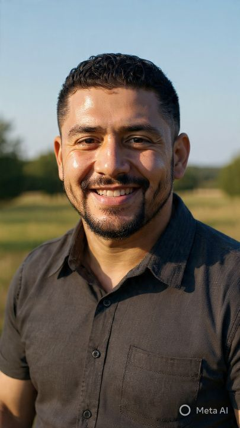

# BE EXTRAORDINARY — WINDSURF CASCADE
# ─────────────────────────────────────
# Paste this into Windsurf Cascade chat exactly as-is.
# Say: "Execute this brief fully, step by step. Do not stop until Step 7 checklist is complete."

---

## YOUR ROLE
You are building a production-ready personal brand website.
Stack: HTML + CSS + vanilla JS. No frameworks. No npm. No build tools.
Design reference: jopecuro.com (bold editorial, serif display, black/white, minimal).

---

## STEP 1 — FOLDER STRUCTURE

Create this folder in the workspace root:

be-extraordinary/
├── index.html
├── quiz.html
└── assets/
    ├── headshot.jpg
    ├── logo-black.jpg
    ├── logo-white.jpg
    ├── testimonial-marcus.jpg
    ├── testimonial-brittany.jpg
    └── testimonial-carlos.jpg

RENAME/COPY these files:
  1000025667.jpeg                                      → assets/headshot.jpg
  1000025664.jpeg                                      → assets/logo-black.jpg
  1000025665.jpeg                                      → assets/logo-white.jpg
  be-extraordinary-execution-blocker-quiz-1-1.html     → quiz.html  [DO NOT EDIT]
  37bd9d8e-bef6-4eaf-b0ee-67e3bf67dc22-1_all_5491.jpg → assets/testimonial-marcus.jpg
  1000021775.jpg                                       → assets/testimonial-brittany.jpg
  37bd9d8e-bef6-4eaf-b0ee-67e3bf67dc22-1_all_5489.jpg → assets/testimonial-carlos.jpg

---

## STEP 2 — CSS DESIGN SYSTEM (paste inside <style> in <head>)

:root {
  --font-display: 'Instrument Serif', Georgia, serif;
  --font-body: 'Inter', 'Helvetica Neue', sans-serif;
  --text-hero: clamp(3.5rem, 1rem + 8vw, 9rem);
  --text-3xl:  clamp(2.5rem, 1rem + 4vw, 5rem);
  --text-2xl:  clamp(2rem, 1.2rem + 2.5vw, 3.5rem);
  --text-xl:   clamp(1.5rem, 1.2rem + 1.25vw, 2.25rem);
  --text-base: clamp(1rem, 0.95rem + 0.25vw, 1.125rem);
  --text-sm:   clamp(0.875rem, 0.8rem + 0.35vw, 1rem);
  --text-xs:   clamp(0.75rem, 0.7rem + 0.25vw, 0.875rem);
  --space-2:.5rem; --space-3:.75rem; --space-4:1rem; --space-6:1.5rem;
  --space-8:2rem; --space-10:2.5rem; --space-12:3rem; --space-16:4rem;
  --space-20:5rem; --space-32:8rem;
  --radius-lg:.75rem; --radius-full:9999px;
  --ease: cubic-bezier(0.16,1,0.3,1);
}
[data-theme="light"] {
  --bg:#fafaf8; --surface:#f4f3ef; --border:rgba(0,0,0,0.08);
  --text:#111110; --text-muted:#6b6a66; --text-faint:#b5b4af;
  --accent:#111110; --inverse:#fafaf8;
}
[data-theme="dark"] {
  --bg:#0f0f0e; --surface:#1a1a18; --border:rgba(255,255,255,0.08);
  --text:#e8e7e3; --text-muted:#787671; --text-faint:#4a4946;
  --accent:#e8e7e3; --inverse:#0f0f0e;
}
*,*::before,*::after{box-sizing:border-box;margin:0;padding:0;}
html{scroll-behavior:smooth;-webkit-font-smoothing:antialiased;scroll-padding-top:80px;}
body{font-family:var(--font-body);font-size:var(--text-base);color:var(--text);background:var(--bg);line-height:1.6;transition:background 200ms var(--ease),color 200ms var(--ease);}
img{display:block;max-width:100%;height:auto;}
a{color:inherit;text-decoration:none;}
ul{list-style:none;}
button{cursor:pointer;background:none;border:none;font:inherit;color:inherit;}
h1,h2,h3{text-wrap:balance;line-height:1.05;}
p{text-wrap:pretty;}
::selection{background:rgba(0,0,0,.12);}
:focus-visible{outline:2px solid var(--accent);outline-offset:3px;border-radius:4px;}

/* Scroll fade — opacity only, no translateY = zero layout shift */
@supports(animation-timeline:scroll()){
  .fade-in{opacity:0;animation:fadeReveal linear both;animation-timeline:view();animation-range:entry 0% entry 60%;}
}
@keyframes fadeReveal{to{opacity:1;}}

/* Marquee */
@keyframes marquee{to{transform:translateX(-50%);}}
.marquee-track{display:flex;gap:var(--space-10);animation:marquee 28s linear infinite;width:max-content;}
.marquee-wrap:hover .marquee-track{animation-play-state:paused;}

@media(prefers-reduced-motion:reduce){*{animation-duration:.01ms!important;transition-duration:.01ms!important;}}

/* Utility classes */
.btn-primary{display:inline-flex;align-items:center;gap:.5rem;font-size:var(--text-sm);font-weight:600;padding:14px 28px;border-radius:var(--radius-full);background:var(--accent);color:var(--inverse);transition:opacity 200ms,transform 200ms;}
.btn-primary:hover{opacity:.8;transform:translateY(-1px);}
.btn-ghost{display:inline-flex;align-items:center;gap:.5rem;font-size:var(--text-sm);font-weight:500;color:var(--text-muted);transition:color 200ms;}
.btn-ghost:hover{color:var(--text);}
.section-label{font-size:var(--text-xs);font-weight:600;letter-spacing:.12em;text-transform:uppercase;color:var(--text-faint);margin-bottom:var(--space-8);display:flex;align-items:center;gap:var(--space-3);}
.section-label::after{content:'';flex:1;height:1px;background:var(--border);}
.divider{border:none;border-top:1px solid var(--border);}
.wrap{max-width:1100px;margin-inline:auto;padding-inline:var(--space-8);}

/* NAV */
nav.site-nav{position:fixed;top:0;left:0;right:0;z-index:100;height:72px;display:flex;align-items:center;justify-content:space-between;padding-inline:var(--space-8);background:var(--bg);border-bottom:1px solid var(--border);transition:background 200ms;}
.nav-logo img{height:36px;width:auto;transition:opacity 200ms;}
.nav-links{display:flex;gap:var(--space-8);}
.nav-links a{font-size:var(--text-sm);color:var(--text-muted);transition:color 200ms;}
.nav-links a:hover{color:var(--text);}
.nav-right{display:flex;align-items:center;gap:var(--space-4);}
.theme-btn{width:36px;height:36px;display:flex;align-items:center;justify-content:center;border-radius:var(--radius-full);color:var(--text-muted);transition:color 200ms,background 200ms;}
.theme-btn:hover{color:var(--text);background:var(--surface);}
.mob-toggle{display:none;flex-direction:column;gap:5px;padding:.5rem;}
.mob-toggle span{display:block;width:22px;height:1.5px;background:var(--text);border-radius:2px;}
@media(max-width:768px){
  .nav-links{display:none;flex-direction:column;position:fixed;top:72px;left:0;right:0;background:var(--bg);padding:var(--space-6) var(--space-8);border-bottom:1px solid var(--border);gap:var(--space-4);z-index:99;}
  .nav-links.open{display:flex;}
  .mob-toggle{display:flex;}
}

/* HERO */
.hero{padding-top:130px;padding-bottom:var(--space-32);}
.hero-eyebrow{display:inline-flex;align-items:center;gap:.5rem;font-size:var(--text-xs);font-weight:600;letter-spacing:.12em;text-transform:uppercase;color:var(--text-muted);margin-bottom:var(--space-8);}
.hero-eyebrow::before{content:'';width:24px;height:1px;background:var(--text-muted);}
.hero-h1{font-family:var(--font-display);font-size:var(--text-hero);font-weight:400;line-height:.95;letter-spacing:-.02em;margin-bottom:var(--space-10);}
.hero-h1 em{font-style:italic;color:var(--text-muted);}
.hero-bottom{display:grid;grid-template-columns:1fr 1fr;gap:var(--space-16);align-items:end;border-top:1px solid var(--border);padding-top:var(--space-8);}
.hero-desc{font-size:var(--text-base);color:var(--text-muted);line-height:1.7;max-width:48ch;}
.hero-actions{display:flex;gap:var(--space-4);align-items:center;justify-content:flex-end;flex-wrap:wrap;}
@media(max-width:768px){
  .hero-bottom{grid-template-columns:1fr;}
  .hero-actions{justify-content:flex-start;}
}

/* MARQUEE */
.marquee-wrap{overflow:hidden;border-top:1px solid var(--border);border-bottom:1px solid var(--border);padding-block:var(--space-6);}
.marquee-item{font-family:var(--font-display);font-size:var(--text-xl);font-style:italic;color:var(--text-faint);white-space:nowrap;display:inline-flex;align-items:center;gap:var(--space-10);}
.marquee-item::after{content:'◆';font-size:.5em;}

/* ABOUT */
.about-grid{display:grid;grid-template-columns:1fr 1.1fr;gap:var(--space-16);align-items:center;}
.photo-wrap{position:relative;}
.photo-wrap img{width:100%;aspect-ratio:3/4;object-fit:cover;border-radius:var(--radius-lg);filter:grayscale(10%);}
.photo-badge{position:absolute;bottom:var(--space-4);left:var(--space-4);background:var(--bg);border:1px solid var(--border);border-radius:var(--radius-full);padding:.375rem var(--space-4);font-size:var(--text-xs);font-weight:600;letter-spacing:.08em;text-transform:uppercase;color:var(--text-muted);}
.about-content{display:flex;flex-direction:column;gap:var(--space-8);}
.about-h2{font-family:var(--font-display);font-size:var(--text-2xl);font-weight:400;line-height:1.1;letter-spacing:-.02em;}
.about-h2 em{font-style:italic;color:var(--text-muted);}
.about-body{font-size:var(--text-base);color:var(--text-muted);line-height:1.75;max-width:52ch;}
.tags{display:flex;flex-wrap:wrap;gap:.5rem;}
.tag{padding:.375rem var(--space-4);border-radius:var(--radius-full);border:1px solid var(--border);font-size:var(--text-xs);font-weight:500;color:var(--text-muted);}
@media(max-width:768px){.about-grid{grid-template-columns:1fr;}.photo-wrap img{aspect-ratio:4/3;}}

/* SERVICES */
.services-h2{font-family:var(--font-display);font-size:var(--text-3xl);font-weight:400;letter-spacing:-.02em;line-height:1;margin-bottom:var(--space-16);}
.services-h2 em{font-style:italic;color:var(--text-muted);}
.services-grid{display:grid;grid-template-columns:repeat(3,1fr);gap:var(--space-4);}
.svc-card{padding:var(--space-8) var(--space-6);border:1px solid var(--border);border-radius:var(--radius-lg);display:flex;flex-direction:column;gap:var(--space-4);transition:background 200ms,transform 200ms;}
.svc-card:hover{background:var(--surface);transform:translateY(-2px);}
.svc-num{font-size:var(--text-xs);font-weight:600;letter-spacing:.1em;color:var(--text-faint);}
.svc-name{font-family:var(--font-display);font-size:var(--text-xl);font-weight:400;line-height:1.15;}
.svc-name em{font-style:italic;}
.svc-desc{font-size:var(--text-sm);color:var(--text-muted);line-height:1.7;flex:1;}
.svc-link{font-size:var(--text-xs);font-weight:600;letter-spacing:.06em;text-transform:uppercase;color:var(--text);display:inline-flex;align-items:center;gap:.5rem;transition:gap 200ms;}
.svc-link:hover{gap:1rem;}
@media(max-width:768px){.services-grid{grid-template-columns:1fr;}}

/* TESTIMONIALS */
.test-intro{display:flex;justify-content:space-between;align-items:flex-end;margin-bottom:var(--space-12);gap:var(--space-8);}
.test-h2{font-family:var(--font-display);font-size:var(--text-3xl);font-weight:400;letter-spacing:-.02em;line-height:1;}
.test-h2 em{font-style:italic;color:var(--text-muted);}
.test-grid{display:grid;grid-template-columns:repeat(3,1fr);gap:var(--space-4);}
.test-card{padding:var(--space-8);border:1px solid var(--border);border-radius:var(--radius-lg);display:flex;flex-direction:column;gap:var(--space-6);transition:background 200ms;}
.test-card:hover{background:var(--surface);}
.test-card blockquote{font-size:var(--text-sm);color:var(--text-muted);line-height:1.75;flex:1;}
.test-card blockquote::before{content:'\201C';font-family:var(--font-display);font-size:2em;color:var(--text-faint);display:block;margin-bottom:.25rem;line-height:1;}
.test-author{display:flex;align-items:center;gap:.75rem;border-top:1px solid var(--border);padding-top:var(--space-4);}
.test-author img{width:44px;height:44px;border-radius:var(--radius-full);object-fit:cover;object-position:top center;}
.test-name{font-size:var(--text-sm);font-weight:600;}
.test-role{font-size:var(--text-xs);color:var(--text-faint);}
@media(max-width:768px){.test-grid{grid-template-columns:1fr;}.test-intro{flex-direction:column;align-items:flex-start;}}

/* QUIZ CTA */
.quiz-card{display:grid;grid-template-columns:1.2fr .8fr;gap:var(--space-16);align-items:center;padding:var(--space-16);border:1px solid var(--border);border-radius:var(--radius-lg);background:var(--surface);}
.quiz-label{font-size:var(--text-xs);font-weight:600;letter-spacing:.12em;text-transform:uppercase;color:var(--text-faint);margin-bottom:var(--space-4);}
.quiz-h2{font-family:var(--font-display);font-size:var(--text-2xl);font-weight:400;letter-spacing:-.02em;line-height:1.1;margin-bottom:var(--space-6);}
.quiz-h2 em{font-style:italic;color:var(--text-muted);}
.quiz-desc{font-size:var(--text-base);color:var(--text-muted);line-height:1.7;max-width:48ch;margin-bottom:var(--space-8);}
.quiz-stats{border-left:1px solid var(--border);padding-left:var(--space-12);display:flex;flex-direction:column;gap:var(--space-6);}
.stat-num{font-family:var(--font-display);font-size:var(--text-2xl);font-weight:400;letter-spacing:-.02em;line-height:1;}
.stat-lbl{font-size:var(--text-xs);font-weight:600;letter-spacing:.08em;text-transform:uppercase;color:var(--text-muted);}
@media(max-width:768px){.quiz-card{grid-template-columns:1fr;padding:var(--space-8);}.quiz-stats{border-left:none;padding-left:0;border-top:1px solid var(--border);padding-top:var(--space-6);display:grid;grid-template-columns:1fr 1fr;gap:var(--space-4);}}

/* BIG CTA */
.big-cta{padding-block:clamp(var(--space-20),12vw,var(--space-32));text-align:center;border-top:1px solid var(--border);}
.big-eyebrow{font-size:var(--text-xs);font-weight:600;letter-spacing:.12em;text-transform:uppercase;color:var(--text-faint);margin-bottom:var(--space-8);}
.big-h2{font-family:var(--font-display);font-size:var(--text-hero);font-weight:400;line-height:.95;letter-spacing:-.03em;max-width:10ch;margin-inline:auto;margin-bottom:var(--space-12);}
.big-h2 em{font-style:italic;color:var(--text-muted);}
.big-actions{display:flex;gap:var(--space-4);justify-content:center;align-items:center;flex-wrap:wrap;}

/* FOOTER */
footer{border-top:1px solid var(--border);padding:var(--space-10) var(--space-8);display:flex;align-items:center;justify-content:space-between;max-width:1100px;margin-inline:auto;}
.footer-left{display:flex;align-items:center;gap:var(--space-8);}
.footer-left img{height:28px;width:auto;}
.footer-copy{font-size:var(--text-xs);color:var(--text-faint);}
.footer-links{display:flex;gap:var(--space-6);}
.footer-links a{font-size:var(--text-xs);color:var(--text-muted);transition:color 200ms;}
.footer-links a:hover{color:var(--text);}
.footer-mantra{font-family:var(--font-display);font-style:italic;font-size:var(--text-sm);color:var(--text-faint);}
@media(max-width:768px){footer{flex-direction:column;gap:var(--space-6);text-align:center;}.footer-left{flex-direction:column;gap:var(--space-3);}.footer-links{flex-wrap:wrap;justify-content:center;}}

/* Section padding */
.section{padding-block:clamp(var(--space-16),8vw,var(--space-32));}

---

## STEP 3 — HTML STRUCTURE

Write index.html using this exact structure.
Replace [CONTENT] markers with content from COPY section below.

```html
<!DOCTYPE html>
<html lang="en" data-theme="light">
<head>
  <meta charset="UTF-8">
  <meta name="viewport" content="width=device-width, initial-scale=1.0">
  <title>Be Extraordinary — Antwane Leater | Execution Strategist</title>
  <meta name="description" content="Antwane Leater helps driven entrepreneurs break execution barriers. Book your Forensic Audit.">
  <meta property="og:title" content="Be Extraordinary — Antwane Leater">
  <meta property="og:description" content="Stop stalling. Start executing.">
  <meta property="og:url" content="https://be-extraordinary.site">
  <link rel="preconnect" href="https://fonts.googleapis.com">
  <link rel="preconnect" href="https://fonts.gstatic.com" crossorigin>
  <link href="https://fonts.googleapis.com/css2?family=Instrument+Serif:ital@0;1&family=Inter:wght@300;400;500;600&display=swap" rel="stylesheet">
  <style>
    [PASTE FULL CSS FROM STEP 2 HERE]
  </style>
</head>
<body>

<!-- SKIP LINK -->
<a href="#main" style="position:absolute;top:-100px;left:1rem;background:var(--accent);color:var(--inverse);padding:.5rem 1rem;border-radius:4px;z-index:999;font-size:var(--text-sm);transition:top .2s;" onfocus="this.style.top='1rem'">Skip to content</a>

<!-- NAV -->
<nav class="site-nav" role="navigation" aria-label="Main navigation">
  <div class="nav-logo">
    <a href="#"></a>
  </div>
  <ul class="nav-links" id="nav-links" role="list">
    <li><a href="#about">About</a></li>
    <li><a href="#services">What I Do</a></li>
    <li><a href="#testimonials">Results</a></li>
    <li><a href="#quiz">Free Quiz</a></li>
  </ul>
  <div class="nav-right">
    <button class="theme-btn" data-theme-toggle aria-label="Switch to dark mode">
      [MOON SVG ICON]
    </button>
    <a href="https://silver-stream-pay.lovable.app" target="_blank" rel="noopener noreferrer" class="btn-primary">Book Audit →</a>
    <button class="mob-toggle" id="mob-toggle" aria-label="Open menu" aria-expanded="false">
      <span></span><span></span><span></span>
    </button>
  </div>
</nav>

<main id="main">

  <!-- HERO -->
  <section class="hero wrap" aria-labelledby="hero-h1">
    <p class="hero-eyebrow">Moreno Valley, CA — Execution Strategist</p>
    <h1 class="hero-h1" id="hero-h1">
      Stop<br><em>stalling.</em><br>Start<br>executing.
    </h1>
    <div class="hero-bottom">
      <p class="hero-desc">I'm Antwane Leater — execution strategist for driven entrepreneurs who are idea-rich and action-poor. I don't motivate you. I dismantle what's blocking you and build a system that forces results.</p>
      <div class="hero-actions">
        <a href="https://silver-stream-pay.lovable.app" target="_blank" rel="noopener noreferrer" class="btn-primary">Book Your Forensic Audit →</a>
        <a href="#quiz" class="btn-ghost">Take the Quiz ↓</a>
      </div>
    </div>
  </section>

  <hr class="divider">

  <!-- MARQUEE -->
  <div class="marquee-wrap" aria-hidden="true">
    <div class="marquee-track">
      <span class="marquee-item">Excel. Exceed. Inspire</span>
      <span class="marquee-item">Execution Over Excuses</span>
      <span class="marquee-item">90-Day Architecture</span>
      <span class="marquee-item">Results Not Rhetoric</span>
      <span class="marquee-item">Be Extraordinary</span>
      <span class="marquee-item">Forensic Audit</span>
      <span class="marquee-item">Excel. Exceed. Inspire</span>
      <span class="marquee-item">Execution Over Excuses</span>
      <span class="marquee-item">90-Day Architecture</span>
      <span class="marquee-item">Results Not Rhetoric</span>
      <span class="marquee-item">Be Extraordinary</span>
      <span class="marquee-item">Forensic Audit</span>
    </div>
  </div>

  <hr class="divider">

  <!-- ABOUT -->
  <section class="section wrap fade-in" id="about">
    <div class="about-grid">
      <div class="photo-wrap">
        
        <span class="photo-badge">Antwane Leater</span>
      </div>
      <div class="about-content">
        <p class="section-label">About</p>
        <h2 class="about-h2">I excavate<br>what's <em>actually</em><br>stopping you.</h2>
        <p class="about-body">Most coaching gives you inspiration. I give you a diagnosis. I use a Forensic Audit process to find the exact gap between where you are and where you're trying to go — then build a 90-day execution architecture around it.</p>
        <p class="about-body">I work with entrepreneurs who already know what they want. They just can't seem to close the distance. That's where I come in. No fluff. No cheerleading. Just the system that gets you there.</p>
        <div class="tags">
          <span class="tag">90-Day Architecture</span>
          <span class="tag">Forensic Audit</span>
          <span class="tag">Accountability Loops</span>
          <span class="tag">Mindset Reprogramming</span>
          <span class="tag">Execution Systems</span>
        </div>
        <a href="https://silver-stream-pay.lovable.app" target="_blank" rel="noopener noreferrer" class="btn-primary" style="align-self:flex-start;">Work With Antwane →</a>
      </div>
    </div>
  </section>

  <hr class="divider">

  <!-- SERVICES -->
  <section class="section wrap fade-in" id="services">
    <p class="section-label">What I Do</p>
    <h2 class="services-h2">I work to give clients<br><em>extraordinary</em> results.</h2>
    <div class="services-grid">
      <article class="svc-card">
        <span class="svc-num">01</span>
        <h3 class="svc-name">Forensic <em>Audit</em></h3>
        <p class="svc-desc">A deep diagnostic session to identify exactly what's blocking your momentum — mindset, systems, or strategy. You leave with clarity and a precise roadmap forward.</p>
        <a href="https://silver-stream-pay.lovable.app" target="_blank" rel="noopener noreferrer" class="svc-link">Book Now →</a>
      </article>
      <article class="svc-card">
        <span class="svc-num">02</span>
        <h3 class="svc-name">90-Day <em>Architecture</em></h3>
        <p class="svc-desc">A custom execution system built around your goals: daily accountability loops, weekly targets, and the exact sequence of actions to hit your breakthrough in 90 days.</p>
        <a href="https://silver-stream-pay.lovable.app" target="_blank" rel="noopener noreferrer" class="svc-link">Learn More →</a>
      </article>
      <article class="svc-card">
        <span class="svc-num">03</span>
        <h3 class="svc-name">Execution <em>Coaching</em></h3>
        <p class="svc-desc">Ongoing 1-on-1 coaching with daily 9am/9pm accountability touchpoints. High-frequency, high-stakes — keeps you executing, not just planning.</p>
        <a href="https://silver-stream-pay.lovable.app" target="_blank" rel="noopener noreferrer" class="svc-link">Get Started →</a>
      </article>
    </div>
  </section>

  <hr class="divider">

  <!-- TESTIMONIALS -->
  <section class="section wrap fade-in" id="testimonials">
    <div class="test-intro">
      <div>
        <p class="section-label">Results</p>
        <h2 class="test-h2">Real people.<br><em>Real results.</em></h2>
      </div>
      <a href="https://silver-stream-pay.lovable.app" target="_blank" rel="noopener noreferrer" class="btn-ghost">Get Your Results →</a>
    </div>
    <div class="test-grid">
      <article class="test-card">
        <blockquote>I had the idea for my coaching business for 3 years but kept making excuses. One conversation with Antwane exposed exactly why I was self-sabotaging. Within 60 days I launched, landed my first 5 clients, and hit $4,200 in revenue. He doesn't let you hide behind your potential.</blockquote>
        <div class="test-author">
          
          <div><p class="test-name">Marcus T.</p><p class="test-role">Entrepreneur & Fitness Coach</p></div>
        </div>
      </article>
      <article class="test-card">
        <blockquote>Antwane helped me stop undercharging and start owning my worth. I raised my rates by 40%, restructured my offer suite, and signed my biggest retainer client — $6,500/month — all within 90 days. What he creates isn't just motivation. It's a system that actually works.</blockquote>
        <div class="test-author">
          
          <div><p class="test-name">Brittany R.</p><p class="test-role">Brand Strategist & Creative Director</p></div>
        </div>
      </article>
      <article class="test-card">
        <blockquote>I was stuck analyzing deals and never pulling the trigger. Antwane shifted my mindset from fear-based to execution-based in the first week. I closed my first investment property two months later. The accountability structure he built kept me locked in when doubt crept back.</blockquote>
        <div class="test-author">
          
          <div><p class="test-name">Carlos M.</p><p class="test-role">Real Estate Investor</p></div>
        </div>
      </article>
    </div>
  </section>

  <hr class="divider">

  <!-- QUIZ CTA -->
  <section class="section wrap fade-in" id="quiz">
    <p class="section-label">Free Diagnostic</p>
    <div class="quiz-card">
      <div>
        <p class="quiz-label">Execution Blocker Quiz</p>
        <h2 class="quiz-h2">Find out what's <em>really</em><br>killing your momentum.</h2>
        <p class="quiz-desc">10 questions. 4 blocker profiles. One 72-hour action plan built for your exact pattern. Overthinking, scattered focus, self-doubt, or unsustainable intensity — you'll know in under 3 minutes.</p>
        <a href="quiz.html" target="_blank" rel="noopener noreferrer" class="btn-primary">Take the Free Quiz →</a>
      </div>
      <div class="quiz-stats">
        <div><p class="stat-num">10</p><p class="stat-lbl">Fast Questions</p></div>
        <div><p class="stat-num">4</p><p class="stat-lbl">Blocker Profiles</p></div>
        <div><p class="stat-num">72hr</p><p class="stat-lbl">Action Plan</p></div>
        <div><p class="stat-num">Free</p><p class="stat-lbl">No Email Required</p></div>
      </div>
    </div>
  </section>

  <!-- BIG CTA -->
  <section class="big-cta fade-in">
    <p class="big-eyebrow">Ready to Execute?</p>
    <h2 class="big-h2">Be<br><em>Extra-<br>ordinary.</em></h2>
    <div class="big-actions">
      <a href="https://silver-stream-pay.lovable.app" target="_blank" rel="noopener noreferrer" class="btn-primary" style="font-size:var(--text-base);padding:16px 36px;">Book Your Forensic Audit →</a>
      <a href="quiz.html" target="_blank" rel="noopener noreferrer" class="btn-ghost">Take the Free Quiz first ↗</a>
    </div>
  </section>

</main>

<!-- FOOTER -->
<footer role="contentinfo">
  <div class="footer-left">
    
    <p class="footer-copy">© 2026 Be Extraordinary. Antwane Leater.</p>
  </div>
  <nav aria-label="Footer navigation">
    <ul class="footer-links" role="list">
      <li><a href="#about">About</a></li>
      <li><a href="#services">Services</a></li>
      <li><a href="#testimonials">Results</a></li>
      <li><a href="quiz.html" target="_blank" rel="noopener noreferrer">Free Quiz</a></li>
      <li><a href="https://silver-stream-pay.lovable.app" target="_blank" rel="noopener noreferrer">Book Audit</a></li>
    </ul>
  </nav>
  <p class="footer-mantra">Excel. Exceed. Inspire.</p>
</footer>

<script>
(function(){
  const toggle = document.querySelector('[data-theme-toggle]');
  const root = document.documentElement;
  const navLogo = document.getElementById('nav-logo');
  const footerLogo = document.getElementById('footer-logo');
  let dark = window.matchMedia('(prefers-color-scheme:dark)').matches;
  const MOON = '<svg width="18" height="18" viewBox="0 0 24 24" fill="none" stroke="currentColor" stroke-width="2"><path d="M21 12.79A9 9 0 1 1 11.21 3 7 7 0 0 0 21 12.79z"/></svg>';
  const SUN = '<svg width="18" height="18" viewBox="0 0 24 24" fill="none" stroke="currentColor" stroke-width="2"><circle cx="12" cy="12" r="5"/><path d="M12 1v2M12 21v2M4.22 4.22l1.42 1.42M18.36 18.36l1.42 1.42M1 12h2M21 12h2M4.22 19.78l1.42-1.42M18.36 5.64l1.42-1.42"/></svg>';
  function apply(d){
    root.setAttribute('data-theme', d ? 'dark' : 'light');
    if(toggle){ toggle.innerHTML = d ? SUN : MOON; toggle.setAttribute('aria-label','Switch to '+(d?'light':'dark')+' mode'); }
    const logoSrc = d ? 'assets/logo-white.jpg' : 'assets/logo-black.jpg';
    if(navLogo) navLogo.src = logoSrc;
    if(footerLogo) footerLogo.src = logoSrc;
  }
  apply(dark);
  if(toggle) toggle.addEventListener('click',()=>{ dark=!dark; apply(dark); });
  const mob = document.getElementById('mob-toggle');
  const nl = document.getElementById('nav-links');
  if(mob&&nl){
    mob.addEventListener('click',()=>{ const o=nl.classList.toggle('open'); mob.setAttribute('aria-expanded',o); });
    nl.querySelectorAll('a').forEach(a=>a.addEventListener('click',()=>{ nl.classList.remove('open'); mob.setAttribute('aria-expanded','false'); }));
  }
})();
</script>
</body>
</html>
```

---

## STEP 4 — VERIFY (do not skip)

Open index.html in browser and confirm ALL of these:

[ ] Page loads — all 9 sections visible (Nav, Hero, Marquee, About, Services, Testimonials, Quiz, Big CTA, Footer)
[ ] All 3 testimonial photos render
[ ] Headshot renders in About section
[ ] Logo renders in Nav and Footer
[ ] Dark mode toggle switches theme + logo
[ ] "Book Your Forensic Audit" CTA links → https://silver-stream-pay.lovable.app
[ ] "Take the Quiz" links → quiz.html
[ ] Marquee animates continuously, pauses on hover
[ ] Sections fade in on scroll
[ ] Mobile (375px): no horizontal overflow, hamburger works, all grids stack
[ ] Zero console errors

---

## CONSTRAINTS (hard rules)
- NO React, Vue, Tailwind, Bootstrap, GSAP, AOS, ScrollReveal, or any library
- NO npm or package.json
- NO hardcoded hex values outside :root / [data-theme]
- NO translateY() on scroll-animated elements
- DO NOT rewrite or modify quiz.html
- Zero placeholder/lorem ipsum text anywhere

---

## DEPLOY
Folder be-extraordinary/ → drag to Netlify → point be-extraordinary.site

============================================================
END OF BRIEF
============================================================
